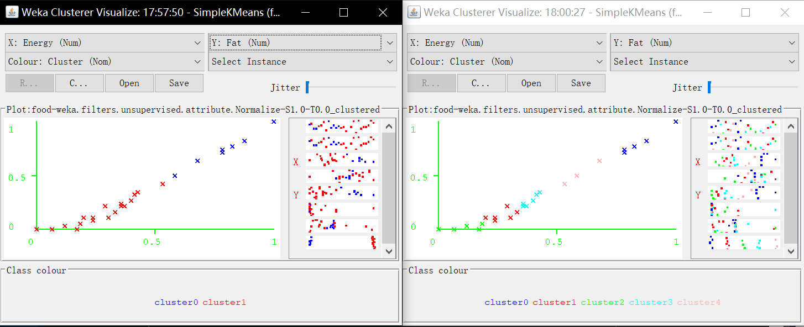
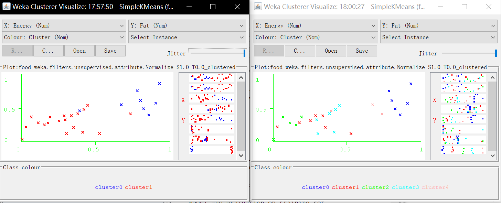
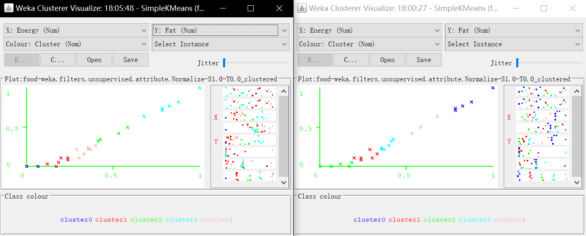
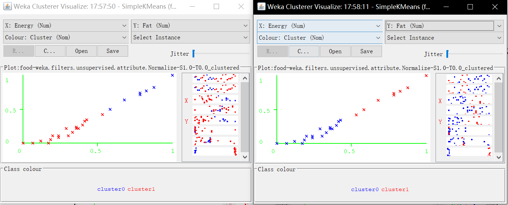
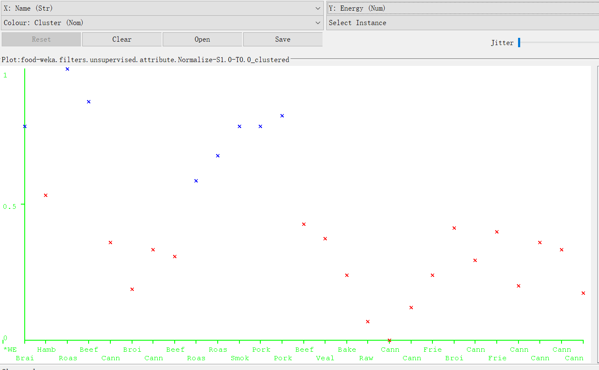
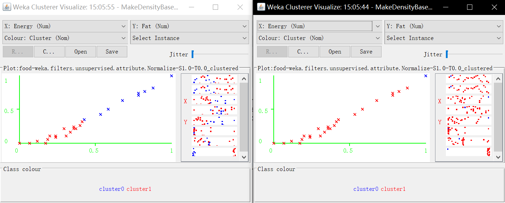

```{r setup, include=FALSE}
knitr::opts_chunk$set(echo = TRUE)
```

# SimpleKmeans

## 1. Choose a set of attributes for clustering and give a motivation. (Hint: always ignore attribute "name". Why does the name attribute need to be ignored?) 

We choose two attributes including *energy* and *fat*. Since the attribute *name* is a nominal variable, and all the elements in such attribute are independent strings. In that case, it could not be useful for our clustering.

## 2. Experiment with at least two different numbers of clusters, e.g. 2 and 5, but with the same seed value 10.

k: 2 vs. 5 
seed: 10
```{r out.height="160px",echo=FALSE}

```

jitter maximum
```{r out.height="160px",echo=FALSE}

```

We scale all the data firstly. The cluster sum of squared errors is 0.85 when *k=2*, but 0.20 when *k=5*. It means that 5-mean algorithm might provide us a better clustering result. However, the plots with *k=5* seem that some of clusters could belong to one cluster.

k: 5 
seed: 20 vs. 10
```{r out.height="160px",echo=FALSE}

```

When we use different seeds for 5-mean algorithm, the final clusters are dissimilar. So the amount of clusters might be too larger.


## 3. Then try with a different seed value, i.e. different initial cluster centers. Compare the results with the previous results. Explain what the seed value controls. 

k: 2 
seed: 10 vs. 20
```{r out.height="160px",echo=FALSE}

```

K-mean algorithm is a method which could only find the local optimals, which means that it relies on the initial random clusters greatly. Different seeds represent different initial random clusters k-mean applies, the final clusters might thereby be different from time to time. This is the reason why we should run k-mean several times for best clustering.

## 4. Do you think the clusters are "good" clusters? (Are all of its members "similar" to each other? Are members from different clusters dissimilar?)

Yes, the cluster is good enough when k=2. According to the plots, there is only one instance with different labels between two clustering (seed=10 and seed=20), which means such kind of result might be the best clustering. 

## 5. What does each cluster represent? Choose one of the results. Make up labels (words or phrases in English) which characterize each cluster.

```{r out.height="200px",echo=FALSE}

```

For example (seed=10 k=2), one of the most importances is that the elements in cluster0 (blue) have more energy and fat, including Hamburger, Roast lamb leg, Roast beef, etc. Compared with roast and smoked food, the canned food have less energy.

\newpage

# MakeDensityBasedClusters

## Experiment with at least two different standard deviations. Compare the results. (Hint: Increasing the standard deviation to higher values will make the differences in different runs more obvious and thus it will be easier to conclude what the parameter does)

MinStdDev: 0.7 vs. 0.001
```{r out.height="200px",echo=FALSE}

```

MinStdDev represents the minimum allowable standard deviation the clustering can bear. It can connect the close instances easily and find the clusters of different shapes and sizes. Since MakeDensityBasedClusters method is sensitive to MinStdDev, the final clusters might conclude all the instance as a group besides outliers when MinStdDev is very large. 


