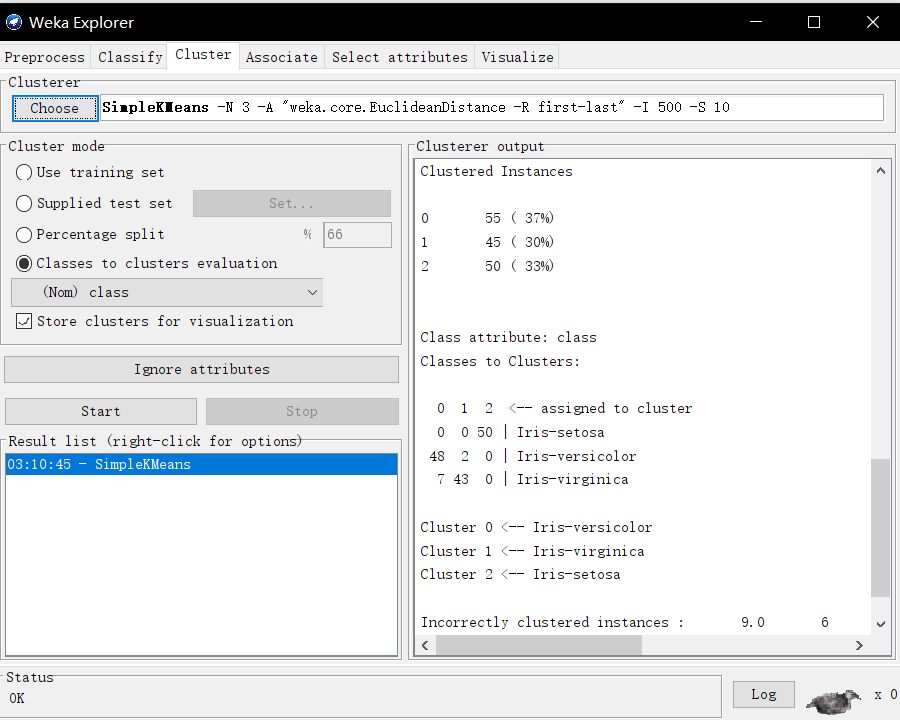
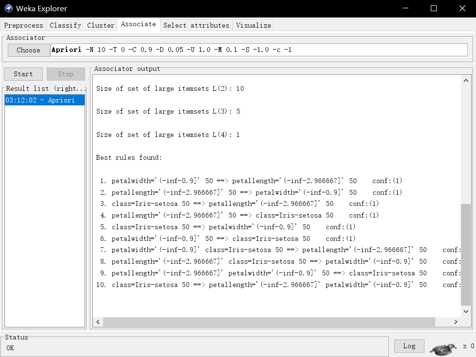
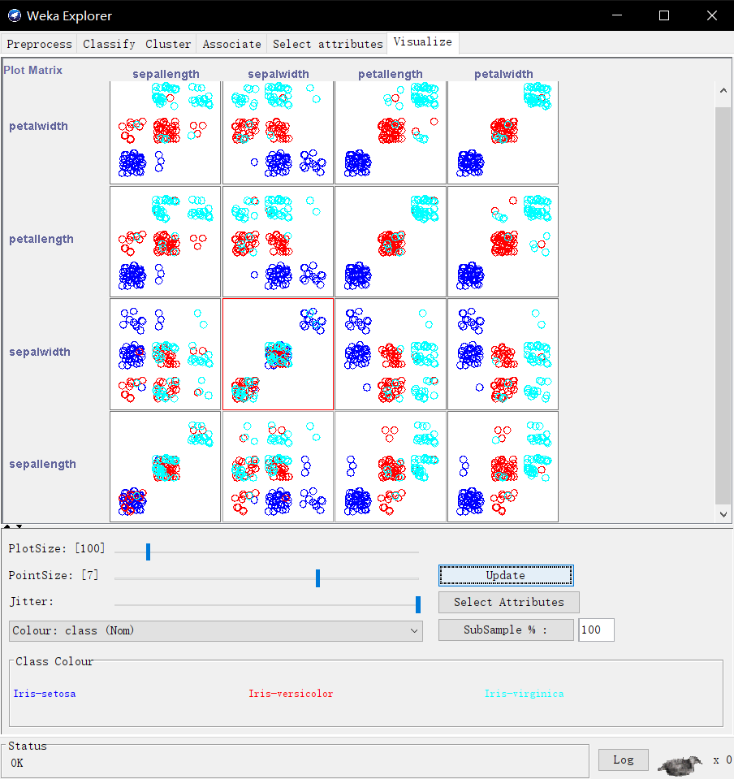
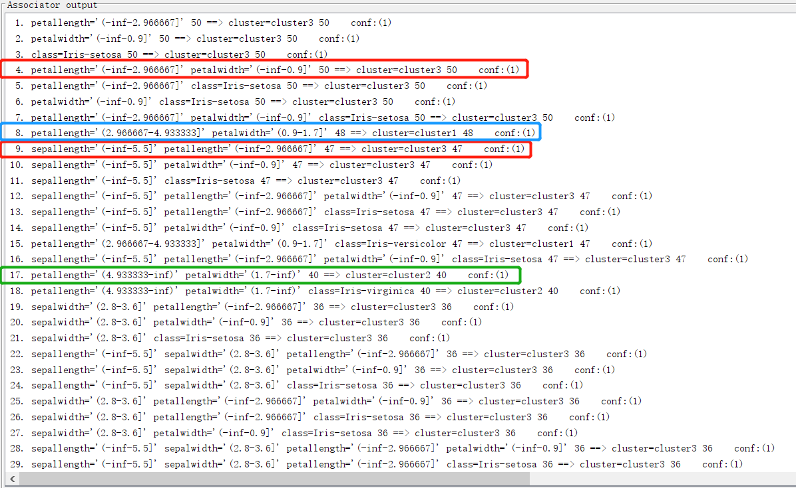
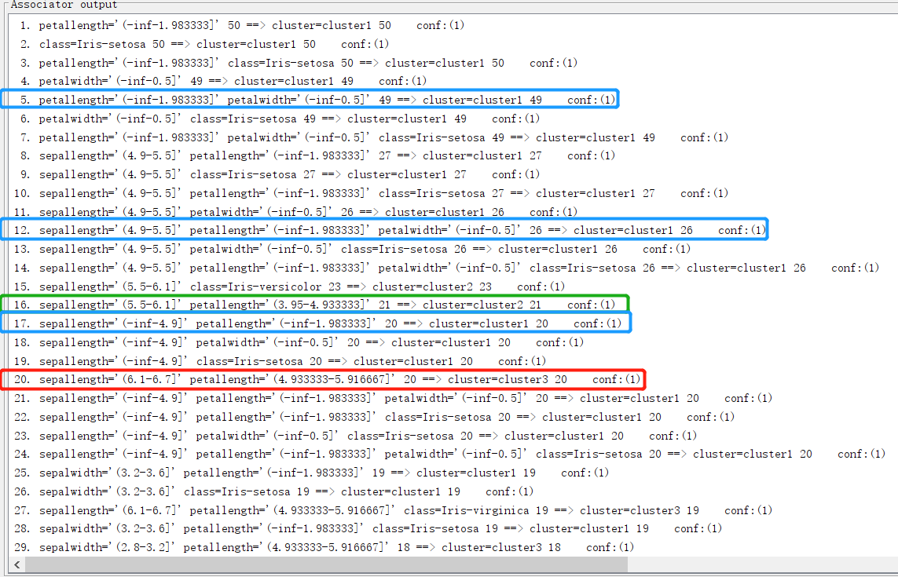
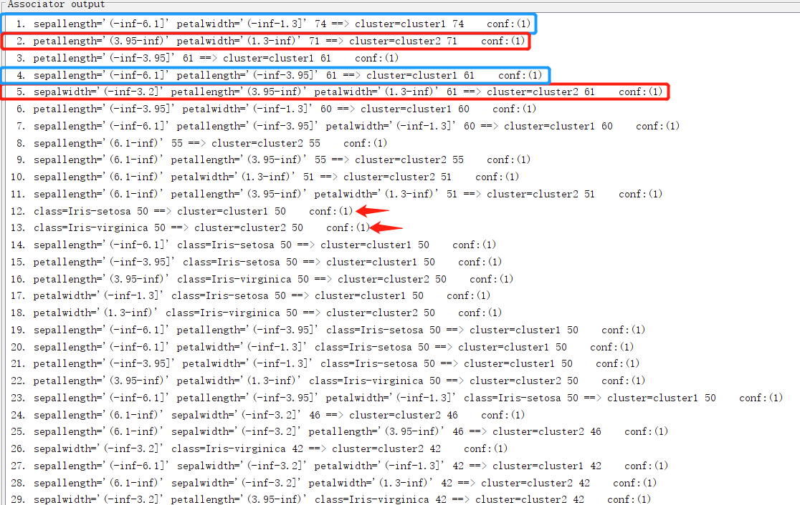

```{r setup, include=FALSE}
knitr::opts_chunk$set(echo = TRUE)
```

## Discretization

Since the attributes of Iris data are numerical, we have to discretize them into 3 intervals firstly.

## Clustering

```{r echo=FALSE,out.width = "240px"}

```

We use `SampleKMeans` to cluster our data into 3 different new clusters. The clustering result is a little different from the original classes.

## Association Anaylsis

```{r echo=FALSE,out.width = "240px"}

```

For association analysis, we use the *Apriori* algorithm with default hyper-parameters to analyze our data. 

## Visualization

```{r echo=FALSE,out.width= "400px"}

```

The blue points represent Setosa, red points represent Versicolor and cyan represent Virginica.

\newpage
## Describing clustering through association analysis

### Result 1: bins=3, SimpleKMeans, K=3

Generated sets of large itemsets:

Size of set of large itemsets L(1): 14

Size of set of large itemsets L(2): 20

Size of set of large itemsets L(3): 15

Size of set of large itemsets L(4): 6

Size of set of large itemsets L(5): 1

```{r echo=FALSE,out.width = "350px"}

```

Based on the visualization step, each original class has their own intervals for different attributes. Especially for three clusters, it is reasonable to find their one-one correspondence to original classes quickly. We can find cluster 3 is connected with petallength='(-inf-2.966667]' and also with petalwidth='(-inf-0.9]'. Actually, we can find class Setosa and cluster 3 are connected as well by rule 11 & 12. 

For cluster 2, it connects with petallength='(4.933333-inf)' petalwidth='(1.7-inf)'. It seems cluster 2 own most parts of class Virginica. Then for cluster 1, it connects with petallength='(2.966667-4.933333]' petalwidth='(0.9-1.7]', which represents Versicolor.

\newpage
### Result 2: bins=6, SimpleKMeans, K=3

Generated sets of large itemsets:

Size of set of large itemsets L(1): 20

Size of set of large itemsets L(2): 33

Size of set of large itemsets L(3): 24

Size of set of large itemsets L(4): 8

Size of set of large itemsets L(5): 1

```{r echo=FALSE,out.width = "300px"}

```

Compared with result 1, some rules in result 1 are separated into several rules in result 2. So it seems that result 2 can give us more detailed rules for each clustering. 

However, the growth of bins may increase the difficulty for analysis. Similar to overfitting in classification tree, 'more bins' exponentially increases the number of best rules. This situation might ask people more time for analysis (e.g. find each cluster in best rules list).

\newpage
## Result 3: bins=2, SimpleKMeans, K=2

Generated sets of large itemsets:

Size of set of large itemsets L(1): 14

Size of set of large itemsets L(2): 34

Size of set of large itemsets L(3): 37

Size of set of large itemsets L(4): 18

Size of set of large itemsets L(5): 3

```{r echo=FALSE,out.width = "300px"}

```

In the third association analysis, we use bins=2 and K=2 for SimpleKMeans. Cluster 1 and 2 have 75 elements respectively. It is quite good to show the correspondence. The result shows that sepallength='(-inf-6.1]' petalwidth='(-inf-1.3]' has sup=74 with cluster 1, and petallength='(3.95-inf)' petalwidth='(1.3-inf)' has sup=71 with cluster 2.

Additionally, cluster 1 contains all the elements from class Setosa, and cluster 2 contains all from class Virginica. We find the first class Versocolor at 59th line: 

```
59. sepallength='(-inf-6.1]' petalwidth='(-inf-1.3]' class=Iris-versicolor 24 ==> cluster=cluster1 24
```

It seems this class Versicolor is separated into 2 new clusters. Such situation is not preferable because we can find such proporties is the same as in the 1st line:

```
 1. sepallength='(-inf-6.1]' petalwidth='(-inf-1.3]' 74 ==> cluster=cluster1 74 
```

This is confused. Thus, the small number of bins or K might results in the ambiguous and underfitting classification. it decreases the accuracy of clustering, especially when the number of real classes is larger than bins and K. It would be more efficient if we can choose appropriate hyper-parameters for clustering and association analysis.


